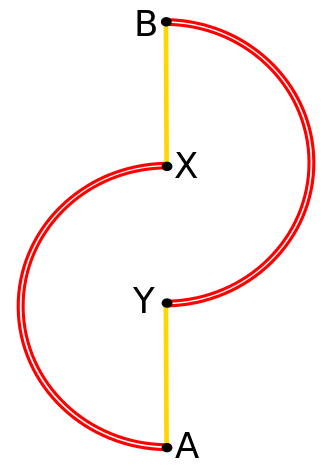
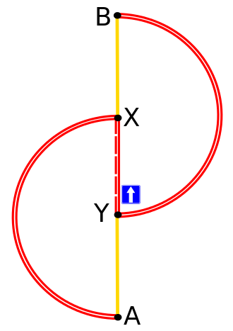

# Braess paradox simulation

Basic simulation demonstrating Braess paradox https://en.wikipedia.org/wiki/Braess%27s_paradox

With road schemes as follows:

Default            |  With additional road
:-------------------------:|:-------------------------:
  |  

Red highway travel time is 50ms with max capacity of 100.
Yellow local road travel time is 10ms with max capacity of 10.
Additional road in the middle has travel time 45ms with max capacity of 20.

Average travel time observed was higher by 1% with additional road.

Default            |  With additional road
:-------------------------:|:-------------------------:
 0.060254s |  0.065366s

Images source: https://pl.wikipedia.org/wiki/Paradoks_Braessa

